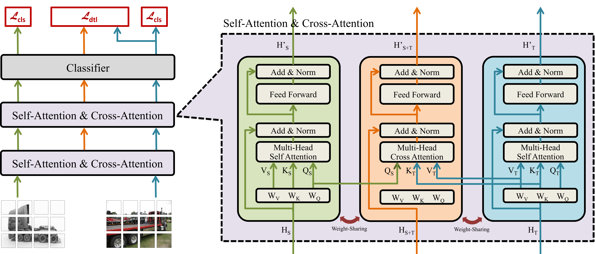

# CDTrans: Cross-domain Transformer for Unsupervised Domain Adaptation

## Introduction

This is the official code of CDTrans: Cross-domain Transformer for Unsupervised Domain Adaptation.


## Results
#### Table 1 [UDA results on Office-31]
<table cellspacing="0" border="1">
	<colgroup width="130"></colgroup>
	<colgroup width="60"></colgroup>
	<colgroup span="6" width="60"></colgroup>
	<tr>
		<td  height="28" align="left" >Methods</td><td  align="center" >Avg.</td>
		<td  align="center" >A-&gt;D</td><td  align="center" >A-&gt;W</td><td  align="center" >D-&gt;A</td><td  align="center" >D-&gt;W</td><td  align="center" >W-&gt;A</td><td  align="center" >W-&gt;D</td>
	</tr>
	<tr>
		<td  rowspan=2 height="56" align="left" >Baseline(DeiT-S)</td><td  rowspan=2 align="center" >86.7</td>
		<td  align="center" >87.6</td><td  align="center" >86.9</td><td  align="center" >74.9</td><td  align="center" >97.7</td><td  align="center" >73.5</td><td  align="center" >99.6</td>
	</tr>
	<tr><td  colspan=2 align="center" ><a href='https://drive.google.com/file/d/1SQPLsz-JLBB2O9qtszzf8kEUsa4PKQbf/view?usp=sharing'>model</a></td>
        <td  colspan=2 align="center" ><a href='https://drive.google.com/file/d/1XexYs6tMox5IInl9GkyI5RiUj33Idxji/view?usp=sharing'>model</a></td>
        <td  colspan=2 align="center" ><a href='https://drive.google.com/file/d/1wtAaqu7mzazVnrWUVK1gCUcbsObKNaHB/view?usp=sharing'>model</a></td></tr>
	<tr>
		<td  rowspan=2 height="56" align="left" >CDTrans(DeiT-S)</td><td  rowspan=2 align="center"  sdval="90.4" sdnum="1033;">90.4</td>
		<td  align="center" >94.6</td><td  align="center" >93.5</td><td  align="center" >78.4</td><td  align="center" >98.2</td><td  align="center" >78</td><td  align="center" >99.6</td>
	</tr>
	<tr><td  align="center" ><a href='https://drive.google.com/file/d/1evX6ui1hR07Kq-RcmupZid1B1-BV8Vjy/view?usp=sharing'>model</a></td>
        <td  align="center" ><a href='https://drive.google.com/file/d/1VWFg4GWYA0FYKM4ToWAEBs4t-bgWjkcy/view?usp=sharing'>model</a></td>
        <td  align="center" ><a href='https://drive.google.com/file/d/1w-ftM8Z_D3NcTTupc8Sb3Ef1b-pZTQuy/view?usp=sharing'>model</a></td>
        <td  align="center" ><a href='https://drive.google.com/file/d/1tmou9nmfuf8H0HI9SfcMItSfOqloxoiS/view?usp=sharing'>model</a></td>
        <td  align="center" ><a href='https://drive.google.com/file/d/1QXCI-7XxxM5LoScT-K9hBNsfzNCEkr5o/view?usp=sharing'>model</a></td>
        <td  align="center" ><a href='https://drive.google.com/file/d/1O7RU_I3puJoHO3Bf1bJEhOJIkGDCkFF7/view?usp=sharing'>model</a></td>
	</tr>
	<tr>
		<td  rowspan=2 height="56" align="left" >Baseline(DeiT-B)</td><td  rowspan=2 align="center"  sdval="88.8" sdnum="1033;">88.8</td>
		<td  align="center" >90.8</td><td  align="center" >90.4</td><td  align="center" >76.8</td><td  align="center" >98.2</td><td  align="center" >76.4</td><td  align="center" >100</td>
	</tr>
	<tr><td  colspan=2 align="center" ><a href='https://drive.google.com/file/d/1cN8xethtV9PR-6rr3ibfqQ8qfk17DtDg/view?usp=sharing'>model</a></td>
        <td  colspan=2 align="center" ><a href='https://drive.google.com/file/d/1XS_29Z_L-YXlFJ0eqvVqShbYvBydsLoa/view?usp=sharing'>model</a></td>
        <td  colspan=2 align="center" ><a href='https://drive.google.com/file/d/1vfiuBNfCKczTudWvy6mXjKs-wMkb6ukj/view?usp=sharing'>model</a></td></tr>
	<tr>
		<td  rowspan=2 height="56" align="left" >CDTrans(DeiT-B)</td><td  rowspan=2 align="center"  sdval="92.6" sdnum="1033;">92.6</td>
		<td  align="center" >97</td><td  align="center" >96.7</td><td  align="center" >81.1</td><td  align="center" >99</td><td  align="center" >81.9</td><td  align="center" >100</td>
	</tr>
	<tr><td  align="center" ><a href='https://drive.google.com/file/d/1cWVFsaSNgJMo6BlRgo2c1nUDJQiJbaFG/view?usp=sharing'>model</a></td>
        <td  align="center" ><a href='https://drive.google.com/file/d/118mGuWotd4RBLxx7QKvmLeVl_tKiHtiq/view?usp=sharing'>model</a></td>
        <td  align="center" ><a href='https://drive.google.com/file/d/1Q0GkxoQ_lnWXaUymnf44NdlRPaGDFdB3/view?usp=sharing'>model</a></td>
        <td  align="center" ><a href='https://drive.google.com/file/d/1f68BH4_kxVMFUUqA6MEZZI2LnFCt25uv/view?usp=sharing'>model</a></td>
        <td  align="center" ><a href='https://drive.google.com/file/d/1ZVUzjTD11YUp_MpsRjituqXf3QcgbCz9/view?usp=sharing'>model</a></td>
        <td  align="center" ><a href='https://drive.google.com/file/d/1b3mj876MU7bLuzUGg8ewtRlGyYku616d/view?usp=sharing'>model</a></td></tr>
</table>


#### Table 2 [UDA results on Office-Home]
<table cellspacing="0" border="">
    <colgroup width="130"></colgroup>
	<colgroup span="13" width="60"></colgroup>
	<tr>
		<td height="21" align="left" >Methods</td>
		<td align="center" >Avg.</td>
		<td align="center" >Ar-&gt;Cl</td><td align="center" >Ar-&gt;Pr</td><td align="center" >Ar-&gt;Re</td><td align="center" >Cl-&gt;Ar</td><td align="center" >Cl-&gt;Pr</td><td align="center" 1>Cl-&gt;Re</td>
        <td align="center" >Pr-&gt;Ar</td><td align="center" >Pr-&gt;Cl</td><td align="center" >Pr-&gt;Re</td><td align="center" >Re-&gt;Ar</td><td align="center" >Re-&gt;Cl</td><td align="center" >Re-&gt;Pr</td>
	</tr>
	<tr>
		<td rowspan=2 height="43" align="left" >Baseline(DeiT-S)</td>
		<td rowspan=2 align="center">69.8</td>
		<td align="center">55.6</td><td align="center">73</td><td align="center">79.4</td><td align="center">70.6</td><td align="center">72.9</td><td align="center">76.3</td>
        <td align="center">67.5</td><td align="center">51</td><td align="center">81</td><td align="center">74.5</td><td align="center">53.2</td><td align="center">82.7</td>
	</tr>
	<tr>
		<td colspan=3 align="center" ><a href='https://drive.google.com/file/d/1NHfWlc517DLid-zUPUXX2w0xIgTiFoyh/view?usp=sharing'>model</a></td>
		<td colspan=3 align="center" ><a href='https://drive.google.com/file/d/1ViggnP23TIMw8rc0Qax5JwAObFgQp1Qa/view?usp=sharing'>model</a></td>
		<td colspan=3 align="center" ><a href='https://drive.google.com/file/d/1YHkWXEtpXamclz5klNXOZPqHOKV5Frf1/view?usp=sharing'>model</a></td>
		<td colspan=3 align="center" ><a href='https://drive.google.com/file/d/1FVw0X1jKdVV1_jZ9yoYB8UXGXF8r9erF/view?usp=sharing'>model</a></td>
		</tr>
	<tr>
		<td rowspan=2 height="43" align="left" >CDTrans(DeiT-S)</td><td rowspan=2 align="center">74.7</td>
		<td align="center">60.6</td><td align="center">79.5</td><td align="center">82.4</td><td align="center">75.6</td><td align="center">81.0</td><td align="center">82.3</td>
    <td align="center">72.5</td><td align="center">56.7</td><td align="center">84.4</td><td align="center">77.0</td><td align="center">59.1</td><td align="center">85.5</td>
	</tr>
	<tr>
		<td align="center" ><a href='https://drive.google.com/file/d/1s8bAO3JT569b8Gj7Dmd8jQPgoBGnewOi/view?usp=sharing'>model</a></td>
		<td align="center" ><a href='https://drive.google.com/file/d/183N3_YjBgf27TPk7HZ9hD7WrAnRey_2e/view?usp=sharing'>model</a></td>
		<td align="center" ><a href='https://drive.google.com/file/d/1ZTYLTFxfGVkOUdzcn66vXYA6G1_XBZ-z/view?usp=sharing'>model</a></td>
		<td align="center" ><a href='https://drive.google.com/file/d/1bQGkilf-t6NPSEGfweGGuQpv4U220Cno/view?usp=sharing'>model</a></td>
		<td align="center" ><a href='https://drive.google.com/file/d/1ikg8W7Gt5X2BjRB_WhvIiftGrMx_EMzz/view?usp=sharing'>model</a></td>
		<td align="center" ><a href='https://drive.google.com/file/d/1FJ2RheXtMXCKpKLeyMJO9oeg4Jf3JWPY/view?usp=sharing'>model</a></td>
		<td align="center" ><a href='https://drive.google.com/file/d/1_czlMW0FOpCdjOxyv4czl7i1kb-CSiZw/view?usp=sharing'>model</a></td>
		<td align="center" ><a href='https://drive.google.com/file/d/1B5_UU9QYkWonhvB1n17pqRhaCwZxkAd1/view?usp=sharing'>model</a></td>
		<td align="center" ><a href='https://drive.google.com/file/d/1BLKcykWv7g9I_Voj19G1325A63iKs7ZN/view?usp=sharing'>model</a></td>
		<td align="center" ><a href='https://drive.google.com/file/d/1q7dYNY793rlnTATnnfIM6RFv5yrRmvwo/view?usp=sharing'>model</a></td>
		<td align="center" ><a href='https://drive.google.com/file/d/1LROAhgJ496z6jBO_2n9b79cmW-7LCMN5/view?usp=sharing'>model</a></td>
		<td align="center" ><a href='https://drive.google.com/file/d/1Cq4DpX25gbldZZ30U335A-ODEvkrCrbx/view?usp=sharing'>model</a></td>
	</tr>
	<tr>
		<td rowspan=2 height="43" align="left" >Baseline(DeiT-B)</td><td rowspan=2 align="center">74.8</td><td align="center">61.8</td><td align="center">79.5</td><td align="center">84.3</td><td align="center">75.4</td>
        <td align="center">78.8</td><td align="center">81.2</td><td align="center">72.8</td><td align="center">55.7</td><td align="center">84.4</td><td align="center">78.3</td><td align="center">59.3</td><td align="center">86</td>
	</tr>
	<tr>
		<td colspan=3 align="center" ><a href='https://drive.google.com/file/d/1n5aJ0v-wJJDs7VMtdUqNA5RRQY98Dunh/view?usp=sharing'>model</a></td>
		<td colspan=3 align="center" ><a href='https://drive.google.com/file/d/18pbh81CEwXRI2DP6KpPvpi0D10Wks1fX/view?usp=sharing'>model</a></td>
		<td colspan=3 align="center" ><a href='https://drive.google.com/file/d/13IUyX_1_dNKtR1SjeIU_TM26wY1mgRS6/view?usp=sharing'>model</a></td>
		<td colspan=3 align="center" ><a href='https://drive.google.com/file/d/1xJtkVjqZ21WAXyW9qxgclVhfanqnc_Ml/view?usp=sharing'>model</a></td>
		</tr>
	<tr>
		<td rowspan=2 height="43" align="left" >CDTrans(DeiT-B)</td>
		<td rowspan=2 align="center">80.5</td>
		<td align="center">68.8</td><td align="center">85</td><td align="center">86.9</td><td align="center">81.5</td><td align="center">87.1</td><td align="center">87.3</td>
        <td align="center">79.6</td><td align="center">63.3</td><td align="center">88.2</td><td align="center">82</td><td align="center">66</td><td align="center">90.6</td>
	</tr>
	<tr>
		<td align="center" ><a href='https://drive.google.com/file/d/1mMBa8NLdwEhHbYE3ewbuLWfLvahklETV/view?usp=sharing'>model</a></td>
		<td align="center" ><a href='https://drive.google.com/file/d/1NAax3zxEKZiM1OWZaAH6Bpj9rnFr2XyK/view?usp=sharing'>model</a></td>
		<td align="center" ><a href='https://drive.google.com/file/d/14oHb877jXnwl91A-ANBNrvfHJ88Y5vYl/view?usp=sharing'>model</a></td>
		<td align="center" ><a href='https://drive.google.com/file/d/1hgBoQDOzonECztuRblF_tq4zxu-oyZs9/view?usp=sharing'>model</a></td>
		<td align="center" ><a href='https://drive.google.com/file/d/1IYg6NQkN0QfSV3zAGUfp19Qs86rD8Oeb/view?usp=sharing'>model</a></td>
		<td align="center" ><a href='https://drive.google.com/file/d/1_6huvUvKqTMUEW9duFamffrXw_4wCFVk/view?usp=sharing'>model</a></td>
		<td align="center" ><a href='https://drive.google.com/file/d/1MIlN6N9XkxQ4rUgwdZghceCAHSGDOpjj/view?usp=sharing'>model</a></td>
		<td align="center" ><a href='https://drive.google.com/file/d/1his1-WjsNcStGEgLGZv-zImIc4qFgQaC/view?usp=sharing'>model</a></td>
		<td align="center" ><a href='https://drive.google.com/file/d/1_5kVVM3OJQKPz3CKAKwMpYmF3s-YeHFA/view?usp=sharing'>model</a></td>
		<td align="center" ><a href='https://drive.google.com/file/d/1R4QvlhjA3FmSKTjHlUPDwUYv-QpfhGd6/view?usp=sharing'>model</a></td>
		<td align="center" ><a href='https://drive.google.com/file/d/190OAGE-Mmb6ub0TizGvJwCJ-MoVs6Q2O/view?usp=sharing'>model</a></td>
		<td align="center" ><a href='https://drive.google.com/file/d/1y_vq5vWlL2pHlSrlQhnm6Im9khX_F-_q/view?usp=sharing'>model</a></td>
	</tr>
</table>


#### Table 3 [UDA results on VisDA-2017]
<table cellspacing="0" border="1">
	<colgroup width="130"></colgroup>
	<colgroup width="100"></colgroup>
	<colgroup span="12" width="60"></colgroup>
	<tr>
		<td height="21" align="left" >Methods</td>
		<td align="center" >Per-class</td>
		<td align="center" >plane</td><td align="center" >bcycl</td><td align="center" >bus</td><td align="center" >car</td><td align="center" >horse</td><td align="center" >knife</td>
        <td align="center" >mcycl</td><td align="center" >person</td><td align="center" >plant</td><td align="center" >sktbrd</td><td align="center" >train</td><td align="center" >truck</td>
	</tr>
	<tr>
		<td height="21" align="left" >Baseline(DeiT-B)</td>
		<td align="center" >67.3 (<a href='https://drive.google.com/file/d/16-hq5ozJbuXYdv7-NooJiHAHvcHQLivH/view?usp=sharing'>model</a>)</td>
		<td align="center">98.1</td><td align="center">48.1</td><td align="center">84.6</td><td align="center">65.2</td><td align="center">76.3</td><td align="center">59.4</td>
        <td align="center">94.5</td><td align="center">11.8</td><td align="center">89.5</td><td align="center">52.2</td><td align="center">94.5</td><td align="center">34.1</td>
	</tr>
	<tr>
		<td height="21" align="left" >CDTrans(DeiT-B)</td>
		<td align="center" >88.4 (<a href='https://drive.google.com/file/d/18O3yY2haA285HRH06EdgFbuaUlHGqi61/view?usp=sharing'>model</a>)</td>
		<td align="center">97.7</td><td align="center">86.39</td><td align="center"> 86.87</td><td align="center">83.33</td><td align="center">97.76</td><td align="center">97.16</td>
        <td align="center">95.93</td><td align="center">84.08</td><td align="center">97.93</td><td align="center">83.47</td><td align="center">94.59</td><td align="center">55.3</td>
	</tr>
</table>


#### Table 4 [UDA results on DomainNet]
<table cellspacing="0" border="1">
	<colgroup span="16" width="111"></colgroup>
	<tr>
		<td height="21" align="center" >Base-S</td><td align="center" >clp</td><td align="center" >info</td><td align="center" >pnt</td><td align="center" >qdr</td><td align="center" >rel</td><td align="center" >skt</td><td align="center" >Avg.</td>
		<td align="center" >CDTrans-S</td><td align="center" >clp</td><td align="center" >info</td><td align="center" >pnt</td><td align="center" >qdr</td><td align="center" >rel</td><td align="center" >skt</td><td align="center" >Avg.</td>
	</tr>
	<tr>
		<td rowspan=2 height="43" align="center" >clp</td>
		<td align="center" >- </td><td align="center"  >21.2 </td><td align="center"  >44.2 </td><td align="center"  >15.3 </td><td align="center"  >59.9 </td><td align="center"  >46.0  </td>
		<td rowspan=2 height="43" align="center"  >37.3 </td>  
		<td rowspan=2 height="43" align="center" >clp</td>
		<td align="center" >- </td><td align="center"  >25.3 </td><td align="center"  >52.5 </td><td align="center"  >23.2 </td><td align="center"  >68.3 </td><td align="center"  >53.2 </td>
		<td rowspan=2 height="43" align="center"  >44.5 </td>
	</tr>
    <tr>
		<td colspan=6 align="center" ><a href='https://drive.google.com/file/d/1wIa1uLPXrNGO1tI9GNfo-MxkNX824d5C/view?usp=sharing'>model</a></td>
		<td align="center" ><a href='https://drive.google.com/file/d/1wIa1uLPXrNGO1tI9GNfo-MxkNX824d5C/view?usp=sharing'>model</a></td>
		<td align="center" ><a href='https://drive.google.com/file/d/1Vc0XlYsFRotYH5RXkmefp0pC1iXF31SA/view?usp=sharing'>model</a></td>
		<td align="center" ><a href='https://drive.google.com/file/d/1W8QXnhyRMtfk6Z9miT4T_eK5SlpNz52W/view?usp=sharing'>model</a></td>
		<td align="center" ><a href='https://drive.google.com/file/d/1qrQ7kiFKoAsw2Y-G2_D7XBvqlB802gkX/view?usp=sharing'>model</a></td>
        <td align="center" ><a href='https://drive.google.com/file/d/1Ffw-TJY-HAVUcvXURkuQ_xxTFRXr-2YM/view?usp=sharing'>model</a></td>
		<td align="center" ><a href='https://drive.google.com/file/d/1ewAu2JPlb4OBm0YYrqLnG-_nAb-ReXA9/view?usp=sharing'>model</a></td>
		</tr>
	<tr>
	<tr>
		<td rowspan=2 height="43" align="center" >info</td>
		<td align="center"  >36.8 </td><td align="center" > - </td><td align="center"  >39.4 </td><td align="center"  >5.4 </td><td align="center"  >52.1 </td><td align="center"  >32.6 </td>
		<td rowspan=2 height="43" align="center"  >33.3 </td>
		<td rowspan=2 height="43" align="center" >info</td>
		<td align="center"  >47.6 </td><td align="center" > - </td><td align="center"  >48.3 </td><td align="center"  >9.9 </td><td align="center"  >62.8 </td><td align="center"  >41.1 </td>
		<td rowspan=2 height="43" align="center"  >41.9</td>
	</tr>
    <tr>
		<td colspan=6 align="center" ><a href='https://drive.google.com/file/d/1D0KT89b36ggHq287lqM2KUVe2ZpsC1Ei/view?usp=sharing'>model</a></td>
		<td align="center" ><a href='https://drive.google.com/file/d/1ejM4qb5ip0sWdwuFhvENV9hwIXjNrqjD/view?usp=sharing'>model</a></td>
		<td align="center" ><a href='https://drive.google.com/file/d/1D0KT89b36ggHq287lqM2KUVe2ZpsC1Ei/view?usp=sharing'>model</a></td>
		<td align="center" ><a href='https://drive.google.com/file/d/1A9SpDy__IeFVfOB0tiBvinvqmzYTFx6f/view?usp=sharing'>model</a></td>
		<td align="center" ><a href='https://drive.google.com/file/d/1Z91qC7ICMaELRy1jC1X_SeK2-E7KFn_y/view?usp=sharing'>model</a></td>
        <td align="center" ><a href='https://drive.google.com/file/d/19gLfp4c3ATxyt0eHnJ4YAkaFGqF8Jk_P/view?usp=sharing'>model</a></td>
		<td align="center" ><a href='https://drive.google.com/file/d/1oFqy_sPvXOXnTpTvQtLrF3xpCwr-3VJ0/view?usp=sharing'>model</a></td>
		</tr>
	<tr>
	<tr>
		<td rowspan=2 height="43" align="center" >pnt</td>
		<td align="center"  >47.1 </td><td align="center"  >21.7 </td><td align="center" > - </td><td align="center"  >5.7 </td><td align="center"  >60.2 </td><td align="center"  >39.9 </td>
		<td rowspan=2 height="43" align="center"  >34.9 </td>
		<td rowspan=2 height="43" align="center" >pnt</td>
		<td align="center"  >55.4 </td><td align="center"  >24.5 </td><td align="center" > - </td><td align="center"  >11.7 </td><td align="center"  >67.4 </td><td align="center"  >48.0 </td>
		<td rowspan=2 height="43" align="center"  >41.4 </td>
	</tr>
    <tr>
		<td colspan=6 align="center" ><a href='https://drive.google.com/file/d/1rlM3amtnHD8ImKlb-_mE7BRC8w7bz6YI/view?usp=sharing'>model</a></td>
		<td align="center" ><a href='https://drive.google.com/file/d/1_mQXxcI8AXWz0Wm7s8nLi4T2xeAPAmZF/view?usp=sharing'>model</a></td>
		<td align="center" ><a href='https://drive.google.com/file/d/1pl1xRpYkqf-xN953vnRpBJ3Im4TrIgtV/view?usp=sharing'>model</a></td>
		<td align="center" ><a href='https://drive.google.com/file/d/1rlM3amtnHD8ImKlb-_mE7BRC8w7bz6YI/view?usp=sharing'>model</a></td>
		<td align="center" ><a href='https://drive.google.com/file/d/1Mhrl_dS1GnY5f_ENMnse45fDpQSLr62i/view?usp=sharing'>model</a></td>
        <td align="center" ><a href='https://drive.google.com/file/d/1HoYyD4fD4l5IHjfwKXIQ7LzC4_-F0MrS/view?usp=sharing'>model</a></td>
		<td align="center" ><a href='https://drive.google.com/file/d/1MRa-d7-rHTGYIRQYwA84-4RyF9jmMmF_/view?usp=sharing'>model</a></td>
		</tr>
	<tr>
	<tr>
		<td rowspan=2 height="43" align="center" >qdr</td>
		<td align="center"  >25.0 </td><td align="center"  >3.3 </td><td align="center"  >10.4 </td><td align="center" >-</td><td align="center"  >18.8 </td><td align="center"  >14.0 </td>
		<td rowspan=2 height="43" align="center"  >14.3 </td>
		<td rowspan=2 height="43" align="center" >qdr</td>
		<td align="center"  >36.6 </td><td align="center"  >5.3 </td><td align="center"  >19.3 </td><td align="center" >-</td><td align="center"  >33.8 </td><td align="center"  >22.7 </td>
		<td rowspan=2 height="43" align="center"  >23.5 </td>
	</tr>
    <tr>
		<td colspan=6 align="center" ><a href='https://drive.google.com/file/d/1se-fARzDND-jxciorlVemn-GAGhcWOGn/view?usp=sharing'>model</a></td>
		<td align="center" ><a href='https://drive.google.com/file/d/1SjHWtp7fq1cBxxXcB9GPpKt9dOQ3smMn/view?usp=sharing'>model</a></td>
		<td align="center" ><a href='https://drive.google.com/file/d/1dfdzzyitkKAqPV6sKMSZMzbHLVAVDT0F/view?usp=sharing'>model</a></td>
		<td align="center" ><a href='https://drive.google.com/file/d/180_FOx6q45PPGK1qNrIT8ALnQMgSfLSw/view?usp=sharing'>model</a></td>
		<td align="center" ><a href='https://drive.google.com/file/d/1se-fARzDND-jxciorlVemn-GAGhcWOGn/view?usp=sharing'>model</a></td>
        <td align="center" ><a href='https://drive.google.com/file/d/1i_t6FSfoTDlhB7Fap54mBDzj44Dx6up4/view?usp=sharing'>model</a></td>
		<td align="center" ><a href='https://drive.google.com/file/d/1n1pLG_shCgnmrcDV00Zq4BuG80zVh8Rn/view?usp=sharing'>model</a></td>
		</tr>
	<tr>
	<tr>
		<td rowspan=2 height="43" align="center" >rel</td>
		<td align="center"  >54.8 </td><td align="center"  >23.9 </td><td align="center"  >52.6 </td><td align="center"  >7.4 </td><td align="center" > - </td><td align="center"  >40.1 </td>
		<td rowspan=2 height="43" align="center"  >35.8 </td>
		<td rowspan=2 height="43" align="center" >rel</td>
		<td align="center"  >61.5 </td><td align="center"  >28.1 </td><td align="center"  >56.8 </td><td align="center"  >12.8 </td><td align="center" > - </td><td align="center"  >47.2 </td>
		<td rowspan=2 height="43" align="center"  >41.3 </td>
	</tr>
    <tr>
		<td colspan=6 align="center" ><a href='https://drive.google.com/file/d/1MYtn93N1vaNz7NX-9-7yRutBGAAprFsx/view?usp=sharing'>model</a></td>
		<td align="center" ><a href='https://drive.google.com/file/d/1lcCuj_9Y7tpmYY_2Xhy8A7xuGmn4srnp/view?usp=sharing'>model</a></td>
		<td align="center" ><a href='https://drive.google.com/file/d/11nmr24dG324qeOffYYr8_t0iH2XQXxOk/view?usp=sharing'>model</a></td>
		<td align="center" ><a href='https://drive.google.com/file/d/1yvj5r3Ukff-sgxcVqXvmN5n2iVBLpfSL/view?usp=sharing'>model</a></td>
		<td align="center" ><a href='https://drive.google.com/file/d/1TaTmHmkYl-vhOgYgC53i701aLkl_J-xC/view?usp=sharing'>model</a></td>
        <td align="center" ><a href='https://drive.google.com/file/d/1MYtn93N1vaNz7NX-9-7yRutBGAAprFsx/view?usp=sharing'>model</a></td>
		<td align="center" ><a href='https://drive.google.com/file/d/16UOaO1407EzbYJy52_DN_NFAeTbS4fTI/view?usp=sharing'>model</a></td>
		</tr>
	<tr>
	<tr>
		<td rowspan=2 height="43" align="center" >skt</td>
		<td align="center"  >55.6 </td><td align="center"  >18.6 </td><td align="center"  >42.7 </td><td align="center"  >14.9 </td><td align="center"  >55.7 </td><td align="center" > - </td>
		<td rowspan=2 height="43" align="center"  >37.5 </td>
		<td rowspan=2 height="43" align="center" >skt</td>
		<td align="center"  >64.3 </td><td align="center"  >26.1 </td><td align="center"  >53.2 </td><td align="center"  >23.9 </td><td align="center"  >66.2 </td><td align="center" > - </td>
		<td rowspan=2 height="43" align="center"  >46.7 </td>
	</tr>
    <tr>
		<td colspan=6 align="center" ><a href='https://drive.google.com/file/d/1PC8ALQVzvFajkxagKPnV1bn-M5S33qJt/view?usp=sharing'>model</a></td>
		<td align="center" ><a href='https://drive.google.com/file/d/1Y1sHXS5IgJr8IrdN4IdGVYUsCYHD6asy/view?usp=sharing'>model</a></td>
		<td align="center" ><a href='https://drive.google.com/file/d/17VJlPQy3OVmIx-udgJFx_27vdOxIaY_G/view?usp=sharing'>model</a></td>
		<td align="center" ><a href='https://drive.google.com/file/d/1Z50DXxaYhFw0I-m-kdKyyGgFs_WSI9Zf/view?usp=sharing'>model</a></td>
		<td align="center" ><a href='https://drive.google.com/file/d/1o_hL6CoYrLMr079dZAbbfsA2w_l8gWSK/view?usp=sharing'>model</a></td>
        <td align="center" ><a href='https://drive.google.com/file/d/1UBkH51RPNRPU202zfbH7_5NUhhviPdYn/view?usp=sharing'>model</a></td>
		<td align="center" ><a href='https://drive.google.com/file/d/1PC8ALQVzvFajkxagKPnV1bn-M5S33qJt/view?usp=sharing'>model</a></td>
		</tr>
	<tr>
	<tr>
		<td align="center" >Avg.</td><td align="center"  >43.9 </td><td align="center"  >17.7 </td><td align="center"  >37.9 </td><td align="center"  >9.7 </td><td align="center"  >49.3 </td><td align="center"  >34.5 </td><td align="center"  >32.2 </td>
		<td align="center" >Avg.</td><td align="center"  >53.08 </td><td align="center"  >21.86 </td><td align="center"  >46.02 </td><td align="center"  >16.3 </td><td align="center"  >59.7 </td><td align="center"  >42.44 </td><td align="center"  >39.9 </td>
	</tr>
</table>
<table cellspacing="0" border="1">
	<colgroup span="16" width="111"></colgroup>
	<tr>
		<td height="21" align="center" >Base-B</td><td align="center" >clp</td><td align="center" >info</td><td align="center" >pnt</td><td align="center" >qdr</td><td align="center" >rel</td><td align="center" >skt</td><td align="center" >Avg.</td>
		<td align="center" >CDTrans-B</td><td align="center" >clp</td><td align="center" >info</td><td align="center" >pnt</td><td align="center" >qdr</td><td align="center" >rel</td><td align="center" >skt</td><td align="center" >Avg.</td>
	</tr>
	<tr>
		<td rowspan=2 height="43" align="center" >clp</td>
		<td align="center" >- </td><td align="center"  >24.2 </td><td align="center"  >48.9 </td><td align="center"  >15.5 </td><td align="center"  >63.9 </td><td align="center"  >50.7 </td>
		<td rowspan=2 height="43" align="center"  >40.6 </td>
		<td rowspan=2 height="43" align="center" >clp</td>
		<td align="center" >- </td><td align="center"  >29.4 </td><td align="center"  >57.2 </td><td align="center"  >26.0 </td><td align="center"  >72.6 </td><td align="center"  >58.1 </td>
		<td rowspan=2 height="43" align="center"  >48.7 </td>
	</tr>
    <tr>
		<td colspan=6 align="center" ><a href='https://drive.google.com/file/d/1gYTBthlLXZDlzAYrFTme3iywLS9VHxrR/view?usp=sharing'>model</a></td>
		<td align="center" ><a href='https://drive.google.com/file/d/1gYTBthlLXZDlzAYrFTme3iywLS9VHxrR/view?usp=sharing'>model</a></td>
		<td align="center" ><a href='https://drive.google.com/file/d/1P7r1Zr7WQ_Hv7aK9J4-Bl_IYx4pR8PfQ/view?usp=sharing'>model</a></td>
		<td align="center" ><a href='https://drive.google.com/file/d/1mOwjRmFakioD-yU9KCD6uND_Hf4nr4mE/view?usp=sharing'>model</a></td>
		<td align="center" ><a href='https://drive.google.com/file/d/1ozyUXFJIu4N2nsMmUNyAONGztEpS9YLt/view?usp=sharing'>model</a></td>
        <td align="center" ><a href='https://drive.google.com/file/d/1nCY99Jexnu34ZKM3umBD1HlUF4yWy_C4/view?usp=sharing'>model</a></td>
		<td align="center" ><a href='https://drive.google.com/file/d/18b-2qzHEHea33pXNEuK2DvX1dAb39ReT/view?usp=sharing'>model</a></td>
		</tr>
	<tr>
	<tr>
		<td rowspan=2 height="43" align="center" >info</td>
		<td align="center"  >43.5 </td><td align="center" > - </td><td align="center"  >44.9 </td><td align="center"  >6.5 </td><td align="center"  >58.8 </td><td align="center"  >37.6 </td>
		<td rowspan=2 height="43" align="center"  >38.3 </td>
		<td rowspan=2 height="43" align="center" >info</td>
		<td align="center"  >57.0 </td><td align="center" > - </td><td align="center"  >54.4 </td><td align="center"  >12.8 </td><td align="center"  >69.5 </td><td align="center"  >48.4 </td>
		<td rowspan=2 height="43" align="center"  >48.4 </td>
	</tr>
    <tr>
		<td colspan=6 align="center" ><a href='https://drive.google.com/file/d/1WVfFZSChn6_fhiRIe4UyMT4xj1TrOs-L/view?usp=sharing'>model</a></td>
		<td align="center" ><a href='https://drive.google.com/file/d/1Ke-ejkO7fn0orFhLrmbj8CBiysirt4nw/view?usp=sharing'>model</a></td>
		<td align="center" ><a href='https://drive.google.com/file/d/1WVfFZSChn6_fhiRIe4UyMT4xj1TrOs-L/view?usp=sharing'>model</a></td>
		<td align="center" ><a href='https://drive.google.com/file/d/1Z2vkPmWKN6vstRTZRT53AEcOcxMeJZxH/view?usp=sharing'>model</a></td>
		<td align="center" ><a href='https://drive.google.com/file/d/1yXYG6rdjkpqLGeNdB9XRgCgJNiKDgy3y/view?usp=sharing'>model</a></td>
        <td align="center" ><a href='https://drive.google.com/file/d/1YqHH9cWfsChDOOtij1208uvF9zhk5ZiD/view?usp=sharing'>model</a></td>
		<td align="center" ><a href='https://drive.google.com/file/d/1OPVArLFtDbrnrLsjGe11u598T-bz7BnB/view?usp=sharing'>model</a></td>
		</tr>
	<tr>
	<tr>
		<td rowspan=2 height="43" align="center" >pnt</td>
		<td align="center"  >52.8 </td><td align="center"  >23.3 </td><td align="center" > - </td><td align="center"  >6.6 </td><td align="center"  >64.6 </td><td align="center"  >44.5 </td>
		<td rowspan=2 height="43" align="center"  >38.4 </td>
		<td rowspan=2 height="43" align="center" >pnt</td>
		<td align="center"  >62.9 </td><td align="center"  >27.4 </td><td align="center" > - </td><td align="center"  >15.8 </td><td align="center"  >72.1 </td><td align="center"  >53.9 </td>
		<td rowspan=2 height="43" align="center"  >46.4 </td>
	</tr>
    <tr>
		<td colspan=6 align="center" ><a href='https://drive.google.com/file/d/10fQxr-xcBj53zKZx3AETg8UB2h6CGIHw/view?usp=sharing'>model</a></td>
		<td align="center" ><a href='https://drive.google.com/file/d/1aaeOJsOXnrY2T7M-mienRj0ylZpfxPbT/view?usp=sharing'>model</a></td>
		<td align="center" ><a href='https://drive.google.com/file/d/1fDUAOk7ODvig57sJgQqkZ0trKBcZS4DF/view?usp=sharing'>model</a></td>
		<td align="center" ><a href='https://drive.google.com/file/d/10fQxr-xcBj53zKZx3AETg8UB2h6CGIHw/view?usp=sharing'>model</a></td>
		<td align="center" ><a href='https://drive.google.com/file/d/1NXk3GUe8lMmtcYzd6OHR_ij6lWQiHYe7/view?usp=sharing'>model</a></td>
        <td align="center" ><a href='https://drive.google.com/file/d/1n8dP2Li9JTG7SxXyJRplNVjd7SX8H0P7/view?usp=sharing'>model</a></td>
		<td align="center" ><a href='https://drive.google.com/file/d/1FgZqQ8G9ndVntvfL2bbychtNhzmnUEZy/view?usp=sharing'>model</a></td>
		</tr>
	<tr>
	<tr>
		<td rowspan=2 height="43" align="center" >qdr</td>
		<td align="center"  >31.8 </td><td align="center"  >6.1 </td><td align="center"  >15.6 </td><td align="center" >-</td><td align="center"  >23.4 </td><td align="center"  >18.9 </td>
		<td rowspan=2 height="43" align="center"  >19.2 </td>
		<td rowspan=2 height="43" align="center" >qdr</td>
		<td align="center"  >44.6 </td><td align="center"  >8.9 </td><td align="center"  >29.0 </td><td align="center" >-</td><td align="center"  >42.6 </td><td align="center"  >28.5 </td>
		<td rowspan=2 height="43" align="center"  >30.7 </td>
	</tr>
    <tr>
		<td colspan=6 align="center" ><a href='https://drive.google.com/file/d/1n2hUpTnmmytbu_BcBLb4JyzT1cBJNXRp/view?usp=sharing'>model</a></td>
		<td align="center" ><a href='https://drive.google.com/file/d/1UvR-yLWAJrjaqv3oktENN_WFxVT4n7Wl/view?usp=sharing'>model</a></td>
		<td align="center" ><a href='https://drive.google.com/file/d/110odGDmJJzVEzcpx8Xc39ue5Ude7bI9Z/view?usp=sharing'>model</a></td>
		<td align="center" ><a href='https://drive.google.com/file/d/1O8eklJj0u8ptZzFGBQ8ATOgSUsxRlOBE/view?usp=sharing'>model</a></td>
		<td align="center" ><a href='https://drive.google.com/file/d/1n2hUpTnmmytbu_BcBLb4JyzT1cBJNXRp/view?usp=sharing'>model</a></td>
        <td align="center" ><a href='https://drive.google.com/file/d/1_iODUwWGQKHbscj9R-anQbd5lzG0CuqR/view?usp=sharing'>model</a></td>
		<td align="center" ><a href='https://drive.google.com/file/d/1ywk13rQHz4XgayFvbn8BV28Jc5wiQKj0/view?usp=sharing'>model</a></td>
		</tr>
	<tr>
	<tr>
		<td rowspan=2 height="43" align="center" >rel</td>
		<td align="center"  >58.9 </td><td align="center"  >26.3 </td><td align="center"  >56.7 </td><td align="center"  >9.1 </td><td align="center" > - </td><td align="center"  >45.0 </td>
		<td rowspan=2 height="43" align="center"  >39.2 </td>
		<td rowspan=2 height="43" align="center" >rel</td>
		<td align="center"  >66.2 </td><td align="center"  >31.0 </td><td align="center"  >61.5 </td><td align="center"  >16.2 </td><td align="center" > - </td><td align="center"  >52.9 </td>
		<td rowspan=2 height="43" align="center"  >45.6 </td>
	</tr>
    <tr>
		<td colspan=6 align="center" ><a href='https://drive.google.com/file/d/1AVE0yWZEzDVZw-N4743m6WZCG5oPWwLJ/view?usp=sharing'>model</a></td>
		<td align="center" ><a href='https://drive.google.com/file/d/1dcFcQRsptq_whxHCFSTSlKExEZh1VCES/view?usp=sharing'>model</a></td>
		<td align="center" ><a href='https://drive.google.com/file/d/1XGPdzUToOVNCV4b8_VKV85kyEMhCqWMn/view?usp=sharing'>model</a></td>
		<td align="center" ><a href='https://drive.google.com/file/d/15S4gOUoiwfaww4fPYs7Dea_id2MARl7I/view?usp=sharing'>model</a></td>
		<td align="center" ><a href='https://drive.google.com/file/d/1KyrDP0J6j3oU6bjlWS-7C_bNGKF_R92r/view?usp=sharing'>model</a></td>
        <td align="center" ><a href='https://drive.google.com/file/d/1AVE0yWZEzDVZw-N4743m6WZCG5oPWwLJ/view?usp=sharing'>model</a></td>
		<td align="center" ><a href='https://drive.google.com/file/d/1s-JDgnT4cdrNPxZNBvny-rmjEztEwTlD/view?usp=sharing'>model</a></td>
		</tr>
	<tr>
	<tr>
		<td rowspan=2 height="43" align="center" >skt</td>
		<td align="center"  >60.0 </td><td align="center"  >21.1 </td><td align="center"  >48.4 </td><td align="center"  >16.6 </td><td align="center"  >61.7 </td><td align="center" > - </td>
		<td rowspan=2 height="43" align="center"  >41.6 </td>
		<td rowspan=2 height="43" align="center" >skt</td>
		<td align="center"  >69.0 </td><td align="center"  >29.6 </td><td align="center"  >59.0 </td><td align="center"  >27.2 </td><td align="center"  >72.5 </td><td align="center" > - </td>
		<td rowspan=2 height="43" align="center"  >51.5 </td>
	</tr>
    <tr>
		<td colspan=6 align="center" ><a href='https://drive.google.com/file/d/161KevLO2aaE9ASsk0ruPY04hMOtrz-Kn/view?usp=sharing'>model</a></td>
		<td align="center" ><a href='https://drive.google.com/file/d/109iZSOauhJCJsoyjK0ikpaCwxcYYSlpq/view?usp=sharing'>model</a></td>
		<td align="center" ><a href='https://drive.google.com/file/d/1bgBc7z5cdVZJWzahNORlFp-lW7nFtddr/view?usp=sharing'>model</a></td>
		<td align="center" ><a href='https://drive.google.com/file/d/19r_rGcO-ts6tp4hII6PktDs7hvAcmZHQ/view?usp=sharing'>model</a></td>
		<td align="center" ><a href='https://drive.google.com/file/d/10s3bYQ5XNDAijNF-8A9gv24EePBYshce/view?usp=sharing'>model</a></td>
        <td align="center" ><a href='https://drive.google.com/file/d/1EYV5f3IuZWr_mDQKiGwt1HkihhEuHN2u/view?usp=sharing'>model</a></td>
		<td align="center" ><a href='https://drive.google.com/file/d/161KevLO2aaE9ASsk0ruPY04hMOtrz-Kn/view?usp=sharing'>model</a></td>
		</tr>
	<tr>
	<tr>
		<td align="center" >Avg.</td><td align="center"  >49.4 </td><td align="center"  >20.2 </td><td align="center"  >42.9 </td><td align="center"  >10.9 </td><td align="center"  >54.5 </td><td align="center"  >39.3 </td><td align="center"  >36.2 </td>
		<td align="center" >Avg.</td><td align="center"  >59.9 </td><td align="center"  >25.3 </td><td align="center"  >52.2 </td><td align="center"  >19.6 </td><td align="center"  >65.9 </td><td align="center"  >48.4 </td><td align="center"  >45.2 </td>
	</tr>
</table>


## Requirements
### Installation
```bash
pip install -r requirements.txt
(Python version is the 3.7 and the GPU is the V100 with cuda 10.1, cudatoolkit 10.1)
```
### Prepare Datasets
Download the UDA datasets [Office-31](https://drive.google.com/file/d/0B4IapRTv9pJ1WGZVd1VDMmhwdlE/view), [Office-Home](https://www.hemanthdv.org/officeHomeDataset.html), [VisDA-2017](http://csr.bu.edu/ftp/visda17/clf/), [DomainNet](http://ai.bu.edu/M3SDA/)

Then unzip them and rename them under the directory like follow:
(Note that each dataset folder needs to make sure that it contains the txt file that contain the path and lable of the picture, which is already in data/the_dataset of this project. The 'Real World' domain directory name of the Office-Home should be renamed to 'Real_World' for dataset loading. Otherwise you may encounter "FileNotFoundError: [Errno 2] No such file or directory" )

```
data
├── OfficeHomeDataset
│   │── class_name
│   │   └── images
│   └── *.txt
├── domainnet
│   │── class_name
│   │   └── images
│   └── *.txt
├── office31
│   │── class_name
│   │   └── images
│   └── *.txt
├── visda
│   │── train
│   │   │── class_name
│   │   │   └── images
│   │   └── *.txt 
│   └── validation
│       │── class_name
│       │   └── images
│       └── *.txt 
```
### Prepare DeiT-trained Models
For fair comparison in the pre-training data set, we use the DeiT parameter init our model based on ViT. 
You need to download the ImageNet pretrained transformer model : [DeiT-Small](https://dl.fbaipublicfiles.com/deit/deit_small_distilled_patch16_224-649709d9.pth), [DeiT-Base](https://dl.fbaipublicfiles.com/deit/deit_base_distilled_patch16_224-df68dfff.pth) and move them to the `./data/pretrainModel` directory.

## Training
We utilize 1 GPU for pre-training and 2 GPUs for UDA, each with 16G of memory.

# Scripts.
Command input paradigm

`bash scripts/[pretrain/uda]/[office31/officehome/visda/domainnet]/run_*.sh [deit_base/deit_small]`
## For example
DeiT-Base scripts
```bash

# Office-31     Source: Amazon   ->  Target: Dslr, Webcam
bash scripts/pretrain/office31/run_office_amazon.sh deit_base
bash scripts/uda/office31/run_office_amazon.sh deit_base

#Office-Home    Source: Art      ->  Target: Clipart, Product, Real_World
bash scripts/pretrain/officehome/run_officehome_Ar.sh deit_base
bash scripts/uda/officehome/run_officehome_Ar.sh deit_base

# VisDA-2017    Source: train    ->  Target: validation
bash scripts/pretrain/visda/run_visda.sh deit_base
bash scripts/uda/visda/run_visda.sh deit_base

# DomainNet     Source: Clipart  ->  Target: painting, quickdraw, real, sketch, infograph
bash scripts/pretrain/domainnet/run_domainnet_clp.sh deit_base
bash scripts/uda/domainnet/run_domainnet_clp.sh deit_base
```
DeiT-Small scripts
Replace deit_base with deit_small to run DeiT-Small results. An example of training on office-31 is as follows:
```bash
# Office-31     Source: Amazon   ->  Target: Dslr, Webcam
bash scripts/pretrain/office31/run_office_amazon.sh deit_small
bash scripts/uda/office31/run_office_amazon.sh deit_small
```

## Evaluation
```bash
# For example VisDA-2017
python test.py --config_file 'configs/uda.yml' MODEL.DEVICE_ID "('0')" TEST.WEIGHT "('../logs/uda/vit_base/visda/transformer_best_model.pth')" DATASETS.NAMES 'VisDA' DATASETS.NAMES2 'VisDA' OUTPUT_DIR '../logs/uda/vit_base/visda/' DATASETS.ROOT_TRAIN_DIR './data/visda/train/train_image_list.txt' DATASETS.ROOT_TRAIN_DIR2 './data/visda/train/train_image_list.txt' DATASETS.ROOT_TEST_DIR './data/visda/validation/valid_image_list.txt'  
```

## Acknowledgement

Codebase from [TransReID](https://github.com/damo-cv/TransReID)


